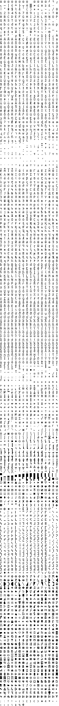

# Cozette Extended

A bitmap programming font optimized for coziness.

This font is licensed under the same  original [Cozette](https://github.com/slavfox/Cozette) font did.

## About

This font is my fork of a splendid Cozette font by Slavfox. Sadly, the author
is busy with real life and cannot review my PR for a long time. So I decided
to make my personal edits to this font public.

I have added a lot of extra glyphs and redesigned a few. I'm lazy and don't
document my changes thouroughly, but I do commit frequently and make a lot of
branches. So, feel free to get whatever branch or commit you want and build it
for yourself.

I build only `.ttf`, because I'm using Windows, and upload them in Release
section. Keep in mind that GitHub command line tool seems to put `master`
branch code in **Source code (zip)** in releases, but the `.ttf` is built
against my latest branch, not `master`.

## Character map (as of [branch:more-icons](https://github.com/cpkio/Cozette/tree/more-icons))

